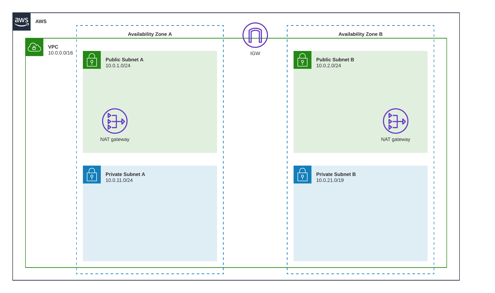
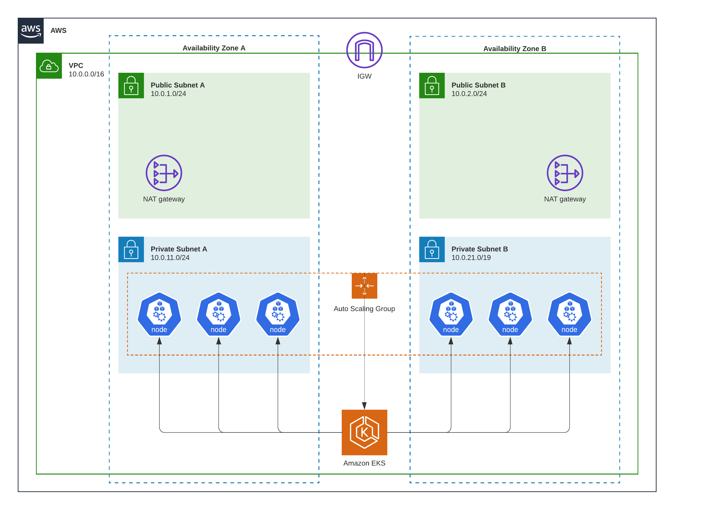
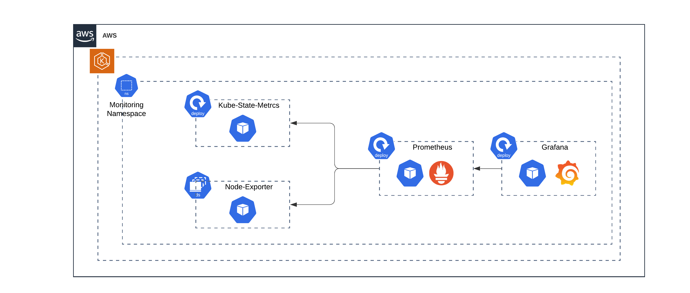
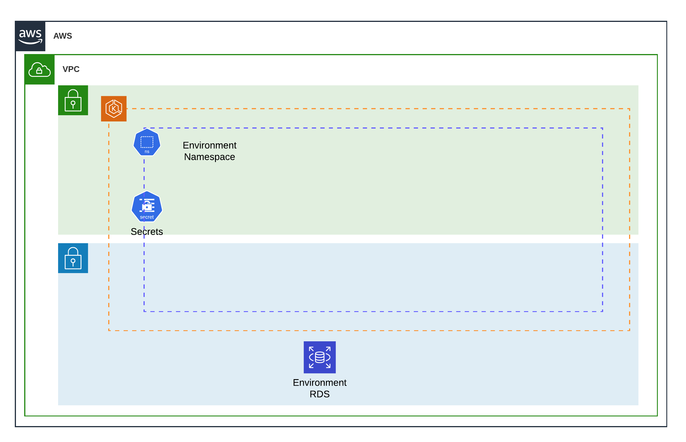

# 4Sale - Centralized Infrastructure Repository

# Overview
This repository contains the terraform IAC for the 4Sale main infrastructure, used to manage the centralized components, such as the VPC, EKS cluster, and the monitoring and logging tools.


# Modules
The IAC is divided into modules, each module is responsible for a specific part of the infrastructure. The modules are as follows:

## [VPC](./modules/00_AWS-EKS-Vpc-2Azs-4Subnets)
The VPC module is responsible for creating the main VPC resources, such as the VPC itself, subnets, route tables, ...etc.

The designed vpc is distributed across 2 availability zones with:
- 1 Internet Gateway
- 2 public subnets, one in each AZ
- 2 private subnets, one in each AZ
- 2 NAT gateways, one in each AZ



**Notes**:
- VPC tags will be applied to subnets in order to be used later by EKS cluster to distinguish between public and private subnets.
    - `kubernetes.io/role/elb: 1` => public subnet
    - `kubernetes.io/role/internal-elb: 1` => private subnet
- The VPC CIDRs are parametrized, and can be changed in the [inputs.auto.tfvars](./inputs.auto.tfvars) file.
## [EKS Cluster](./modules/01_AWS-Eks-Cluster)
The EKS cluster module is responsible for creating the EKS cluster, and the required resources for the cluster, such as the node groups, security groups, ...etc.

The designed EKS cluster characteristics are as follows:
- 1 EKS cluster for the whole infrastructure
- 1 EC2 node group distributed across 2 availability zones for high availability
- Node group will be created within the private subnets



**Notes**:
- The EKS Node group characteristics are parametrized, and can be changed in the [inputs.auto.tfvars](./inputs.auto.tfvars) file.

## [EKS Operations Setup](./modules/02_k8s-ops-setup)
The EKS operations setup module is responsible for setting up the EKS cluster with any needed tools for operations, such as required IAM roles. The module will also pipe any needed outputs from the EKS cluster to be used by repositories that depend on this repository.

## [Monitoring](./modules/03_monitoring)
The Monitoring module is responsible for setting up the monitoring tools for the infrastructure.

The [prometheus-community/kube-prometheus-stack](https://artifacthub.io/packages/helm/prometheus-community/kube-prometheus-stack) helm chart is used to deploy the monitoring stack, which includes:
- Prometheus (with alertmanager)
- Grafana
- kube-state-metrics
- node-exporter



**Notes**:
- The monitoring stack is deployed to the `monitoring` namespace.
- You can control wheter to expose grafana to public or not by setting the `enable_public_grafana` variable in the [inputs.auto.tfvars](./inputs.auto.tfvars) file.

## [Operational Environment](./modules/04_operational-environment)
The Operational Environment module is responsible for setting up the operational environment for the infrastructure, this module is intended to be used many times, each time for a different environment.

The operational environment consists mainly of EKS namespaces, and any other resources that are needed for the environment, so the namespace will contain the following:

- K8S namespace
- K8S secrets and configmaps if needed (within the namespace)
- AWS RDS instance (within the private subnets of the same EKS vpc)

So later, when we want to deploy a new application, we will create a new module that will depend on this module, and will be responsible for deploying the application to the environment.



**Notes**:
- You can control the list of operational environments to available by setting the `operational_environments` variable in the [inputs.auto.tfvars](./inputs.auto.tfvars) file.
- Each operational environment will be deployed and maintained separately as you will see later in the [Usage](#usage) section.

# Tools
- [Terraform](https://www.terraform.io/downloads.html) - Version >= 1.4.6
- [AWS CLI](https://docs.aws.amazon.com/cli/latest/userguide/cli-chap-install.html) - Version >= 2.7.35
- [kubectl](https://kubernetes.io/docs/tasks/tools/install-kubectl/) - Version >= 1.22.0
- [helm](https://helm.sh/docs/intro/install/) - Version >= 3.9.4
- [GNU Make](https://www.gnu.org/software/make/)

# Usage
For simplicity, a Makefile is provided to run the terraform commands, with the help of `.env` file to set the required environment variables.

## Environment Variables
You need to set the environment variables in the `.env` file exactly as the [example.env](./example.env) file, and fill in the values for each variable.

| Variable | Description |
| --------------------------------- | ------------------------------------------------------------------ |
| AWS_PROFILE | The AWS profile to use for terraform |
| CUSTOMER | The customer name, used as a prefix for most of the resources |
| TERRAFORM_BACKEND_S3_BUCKET | The S3 bucket to use for terraform backend |
| TERRAFORM_BACKEND_S3_KEY | The S3 key to use for terraform backend |
| TF_VAR_dockerhub_username | The dockerhub username to use for pulling images from dockerhub |
| TF_VAR_dockerhub_password | The dockerhub password to use for pulling images from dockerhub |
| TF_VAR_grafana_admin_password | The grafana admin password to use for grafana |

## Commands
After configuring environment variables, now you can run the following commands:

- First, you need to configure the aws cli profile to use for terraform, by running the following command:
    ```bash
    # Replace <AWS_PROFILE> with the aws profile name as in the .env file
    aws configure --profile <AWS_PROFILE>
    ```
- Then, you need to initialize terraform by running the following command:
    ```bash
    make init
    ```
    This command will create the S3 bucket for terraform backend (if not exists), and will initialize terraform with the backend configuration.

- Now, you can run the following command to plan the changes:
    ```bash
    # Replace <ENVIRONMENT> with environment name to plan for, e.g. staging, production, ...etc.
    make plan <ENVIRONMENT>
    ```
    This command will plan the changes to be applied to the infrastructure, and will output the changes to be applied.


- Then, you can run the following command to apply the changes:
    ```bash
    # Replace <ENVIRONMENT> with environment name to apply for, e.g. staging, production, ...etc.
    make deploy <ENVIRONMENT>
    ```
    This command will apply the changes to the infrastructure.

- Finally, you can run the following command to destroy the infrastructure:
    ```bash
    # Replace <ENVIRONMENT> with environment name to destroy, e.g. staging, production, ...etc.
    make destroy <ENVIRONMENT>
    ```
    This command will destroy the infrastructure.

- Another command is provided to destroy all the infrastructure, by running the following command:
    ```bash
    make terminate
    ```
    This command will destroy all the infrastructure.

**Note:** For the previous commands, the environment name should be one of the environments defined in the `operational_environments` variable in the [inputs.auto.tfvars](./inputs.auto.tfvars) file, **otherwise the commands will not refelect any changes**.