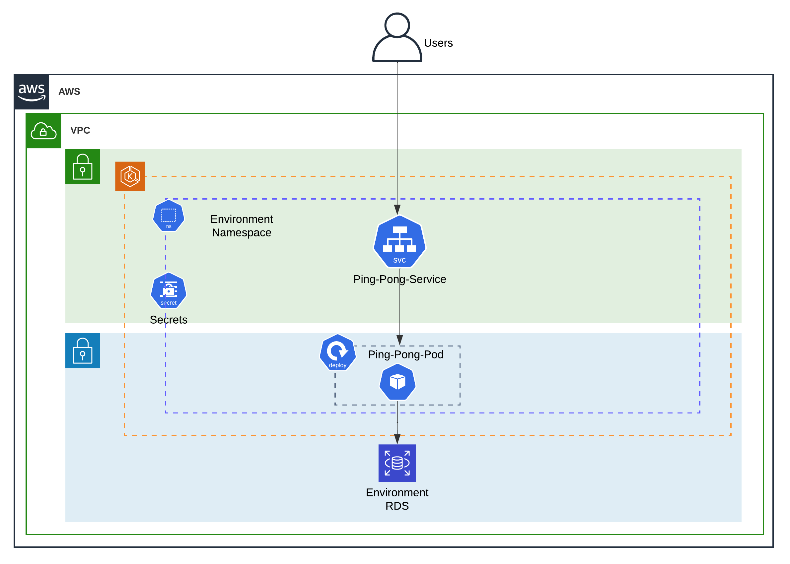
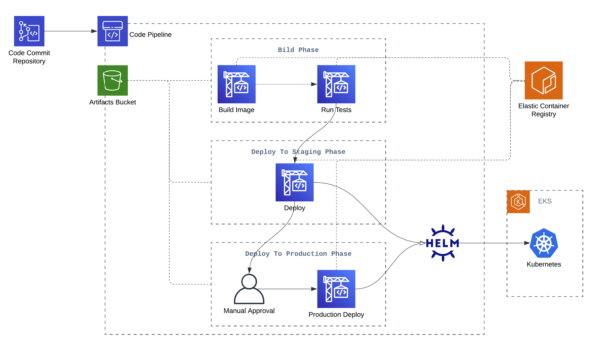
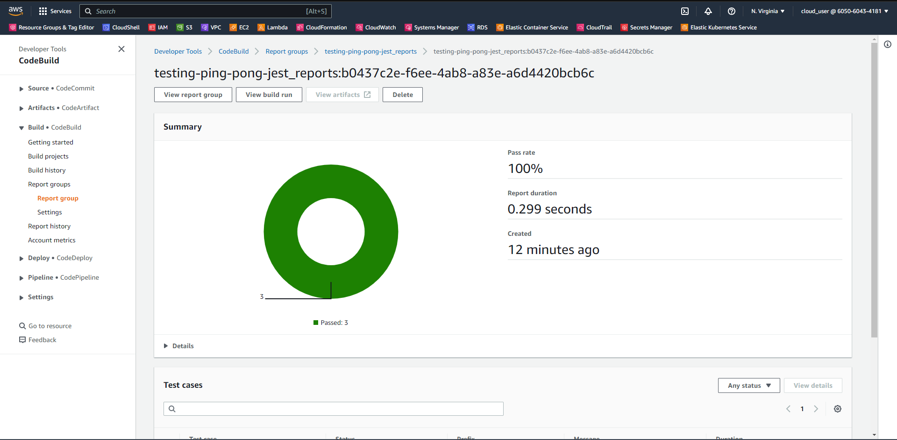

# 4Sale - Ping Pong Service Repository
This repository contains the source code for the Ping Pong service, in addition to the necessary infrastructure code to deploy the service to AWS EKS cluster.

# Directory Structure
The repository is structured as follows:
```
.
├── Readme.md                 
├── docs/                     <-- Documentation files
├── app/                      <-- Source code for the Ping Pong service
├── infrastructure/           <-- IAC for the infrastructure
└── manifest/                 <-- Manifest files for the application
```

# [Application](./app)
The application is a simple REST API that responds with `pong` when it receives a `GET` request to `/ping` endpoint.

## Stack
The application is built using the following stack:
- [Node.js](https://nodejs.org/en/) (v18.16.0)
- [Express.js](https://expressjs.com/)
- [Sequlize](https://sequelize.org/)
- [Jest](https://jestjs.io/)

## Environment Variables
The application needs some environment variables to be set in order to run properly, you can find them in [example.env](./app/example.env) file. The following table lists the environment variables and their descriptions:

| Variable | Description |
| --------------------------------- | ------------------------------------------------------------------ |
| `NODE_ENV` | The environment in which the application is running, can be `development`, `staging`, or `production`. |
| `NODE_CONFIG_DIR` | The directory where the configuration files are located. |
| `PORT` | The port on which the application will listen for incoming requests. |
| `MYSQL_HOST` | The host of the MySQL database. |
| `MYSQL_PORT` | The port of the MySQL database. |
| `MYSQL_USER` | The username of the MySQL database. |
| `MYSQL_PASSWORD` | The password of the MySQL database. |
| `MYSQL_DATABASE` | The name of the MySQL database. |

## Running the application
The application can be run locally using the following command:
```bash
cd app
npm ci
npm start
```
## Endpoints
The application exposes the following endpoints:
- `GET /`: Responds with welcome message.
- `GET /ping`: Responds with `pong` and status code `200` when the application is running and can connect to the database.

## Database
The application uses MySQL database, which should be already provisioned by the [Centralized Infrastructure Repository](../infra-repo).

## Testing
The application contains a sample unit test, which can be run using the following command:
```bash
npm run test
```
The test results are exported to `test-results` directory using [jest-junit](https://www.npmjs.com/package/jest-junit) package.

## Containerization
The application is containerized using Docker, and the Dockerfile can be found in [Dockerfile](./app/Dockerfile).

# [Manifest](./manifest)
The manifest directory contains 2 directories:
## [deployment-chart](./manifest/deployment-chart)
This directory contains the Helm chart for the application, which can be used to deploy the application to a Kubernetes cluster, the chart is simple and contains *only one deployment and one service*.

## [pipeline](./manifest/pipeline)
This directory contains the `buildspec files` for the CI/CD pipeline. we have the following files:

- [build.buildspec.yml](./manifest/pipeline/build.buildspec.yml): This file contains the buildspec for the CodeBuild project that builds the Docker image for the application.

- [testing.buildspec.yml](./manifest/pipeline/testing.buildspec.yml): This file contains the buildspec for the CodeBuild project that runs the unit tests for the application.

- [deployment.buildspec.yml](./manifest/pipeline/deployment.buildspec.yml): This file contains the buildspec for the CodeBuild project that deploys the application to the Kubernetes cluster using [Helm](https://helm.sh/).


# [Infrastructure](./infrastructure)

## Modules
The infrastructure is divided into the following modules:

| Module | Description | Resources |
| --------------------------------- | ------------------------------------------------------------------ | ------------------------------------------------------------------ |
| [Shared App Setup](./infrastructure/modules/00_shared-app-setup) | This module provisions the application specific resources that are shared between all environments. | - AWS ECR Repository |
| [Environment Setup](./infrastructure/modules/01_environment-app-setup) | This module provisions the environment specific resources. | - K8S Helm release for the application. |
| [Pipeline Setup](./infrastructure/modules/02-pipeline-setup) | This module provisions the CI/CD pipeline. | - CodeCommit Trigger. <br> - IAM Roles and policies. <br> - CodePipeline. <br> - Artifacts S3 Bucket <br> - CodeBuild Projects. |

## Operational Environments
Currently, the infrastructure is configured to provision the resources for 2 environments:
- `staging`
- `production`

But we can easily add more environments by injecting the environment config to [inputs.auto.tfvars](./infrastructure/inputs.auto.tfvars) file.

## Usage
For simplicity, a Makefile is provided to run the terraform commands, with the help of `.env` file to set the required environment variables.


### Remote Repository
Before running any infrastructure commands, you need to create the CodeCommit repository on the same AWS account where we are deploying these infra, and push the code to it(if not already done).

### Environment Variables
You need to set the environment variables in the `.env` file exactly as the [example.env](./infrastructure/example.env) file, and fill in the values for each variable, the following table lists the environment variables and their descriptions:

| Variable | Description |
| --------------------------------- | ------------------------------------------------------------------ |
|AWS_PROFILE| The name of the AWS profile to use. |
|APP_NAME| The name of the application, will be used as a prefix for most of the resources. |
|CUSTOMER| The name of the customer, must be exactly the same as the name of the customer in the [Centralized Infrastructure Repository](../infra-repo). |
|TERRAFORM_BACKEND_S3_BUCKET| The name of the S3 bucket to use as a backend for Terraform, must be exactly the same as the name of the bucket in the [Centralized Infrastructure Repository](../infra-repo). |
|TERRAFORM_BACKEND_S3_REGION| The region of the S3 bucket to use as a backend for Terraform, must be exactly the same as the region of the bucket in the [Centralized Infrastructure Repository](../infra-repo). |

### Configurations
You need to configure the following inputs in the [inputs.auto.tfvars](./infrastructure/inputs.auto.tfvars) file:

| Variable | Description |
| --------------------------------- | ------------------------------------------------------------------ |
|codecommit_repo_name| The name of the CodeCommit repository which manually created. |
|repository_branch| The branch of the CodeCommit repository to use. |
|environments_config| configuration for the environments, each environment should have the following attributes: <br> - `name`: The name of the environment. <br> - `manual_approval_required`: Wheter to require manual approval before deployment.|


### Commands
The make file will help you to deploy the changes against each environment separately, also manage the pipeline separately from the environment infrastructure, so you can use the following commands:

- First, you need to configure the aws cli profile to use for terraform, by running the following command:
    ```bash
    # Replace <AWS_PROFILE> with the aws profile name as in the .env file
    aws configure --profile <AWS_PROFILE>
    ```
- Then, you need to initialize terraform by running the following command:
    ```bash
    make init
    ```
    This command will initialize terraform with the backend configuration.

- To plan the for environment infrastructure changes:
    ```bash
    # Replace <ENVIRONMENT> with environment name to plan for, e.g. staging, production, ...etc.
    make plan-env <ENVIRONMENT>
    ```
    This command will plan the changes to be applied to the targeted environment infrastructure.

- To apply the environment infrastructure changes:
    ```bash
    # Replace <ENVIRONMENT> with environment name to apply for, e.g. staging, production, ...etc.
    make deploy-env <ENVIRONMENT>
    ```
    This command will apply the changes to the targeted environment infrastructure.

- To destroy the environment infrastructure:
    ```bash
    # Replace <ENVIRONMENT> with environment name to destroy, e.g. staging, production, ...etc.
    make destroy-env <ENVIRONMENT>
    ```
    This command will destroy the targeted environment infrastructure.

- To plan the pipeline changes:
    ```bash
    make plan-pipeline
    ```
    This command will plan the changes to be applied to the pipeline.

- To apply the pipeline changes:
    ```bash
    make deploy-pipeline
    ```
    This command will apply the changes to the pipeline.

- To destroy the pipeline:
    ```bash
    make destroy-pipeline
    ```
    This command will destroy the pipeline.

- To terminate the environment infrastructure and the pipeline:
    ```bash
    make terminate
    ```
    This command will destroy all the infrastructure and the pipeline related to this repository.

## Final Application Setup
The application deployment per environment would look like the following:



## Final CI/CD Pipeline
Assuming that we have 2 environments: `staging` and `production`, and the `production` requires manual approval.

the CI/CD pipeline would look like the following:



And as as an extra feature you can preview the test reports exported from the unit tests in the pipeline:


